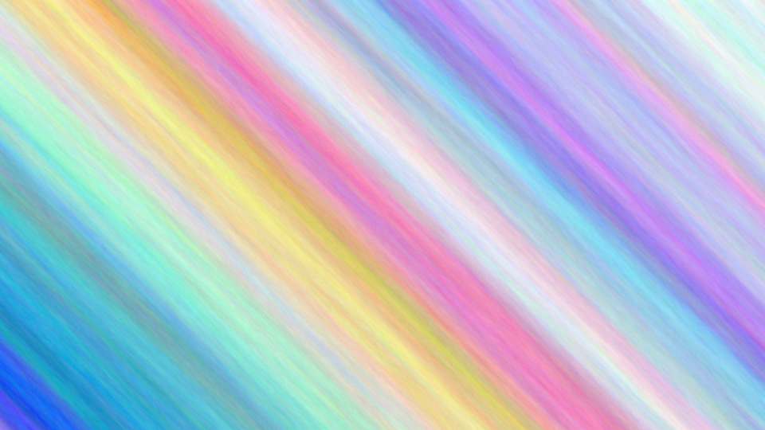

Plumage
=======

Plumage generates colorful pictures.



Building
--------

Clone with Git, then compile with Cargo:

```bash
cargo build --release
```

Usage
-----

Once compiled, run Plumage:

```bash
./target/release/plumage --help
```

Plumage (optionally) reads parameters from `./params` (see [params.example])
and generates a bitmap image, saving both the image and the parameters used to
generate it. These parameters can later be used as input parameters to generate
the same image, or they can serve as a starting point and be tweaked. If any
parameters are missing, they will be filled in with either defaults or random
values.

[params.example]: params.example

[generate.sh] generates images with Plumage in parallel and converts them to
PNG; see `./generate.sh --help`.

[generate.sh]: generate.sh

For now, Plumage is best suited for technical users who wish to look through
the source code or learn by experimentation to discover what the different
parameters do and how the algorithm behaves.

License
-------

Plumage is licensed under version 3 of the GNU Affero General Public License,
or (at your option) any later version. See [LICENSE](LICENSE).

Contributing
------------

By contributing to Plumage, you agree that your contribution may be used
according to the terms of Plumage’s license.
